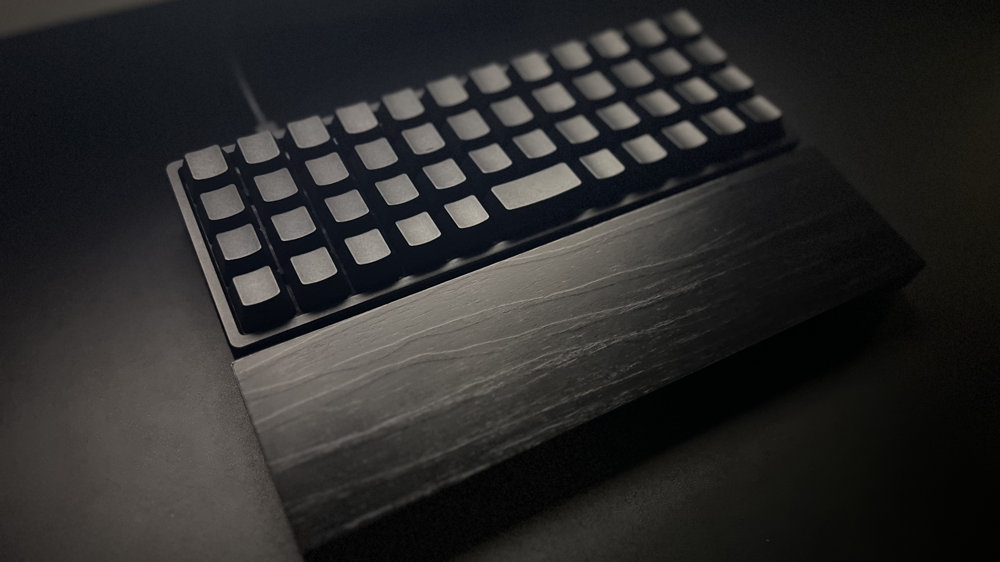
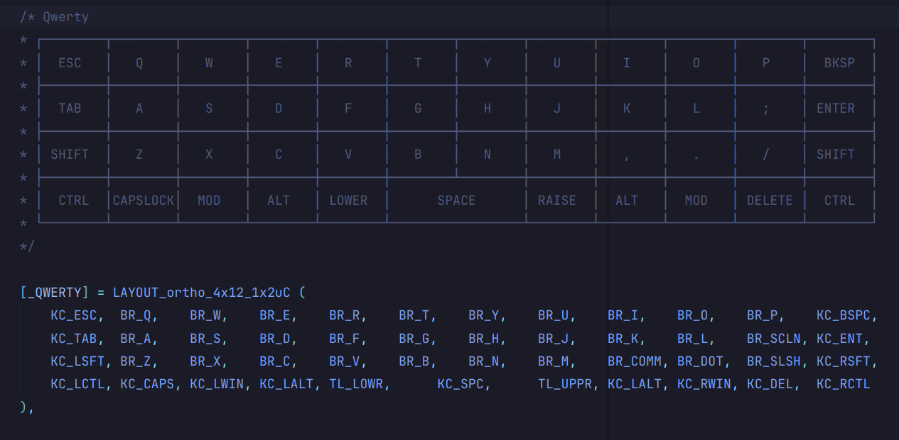
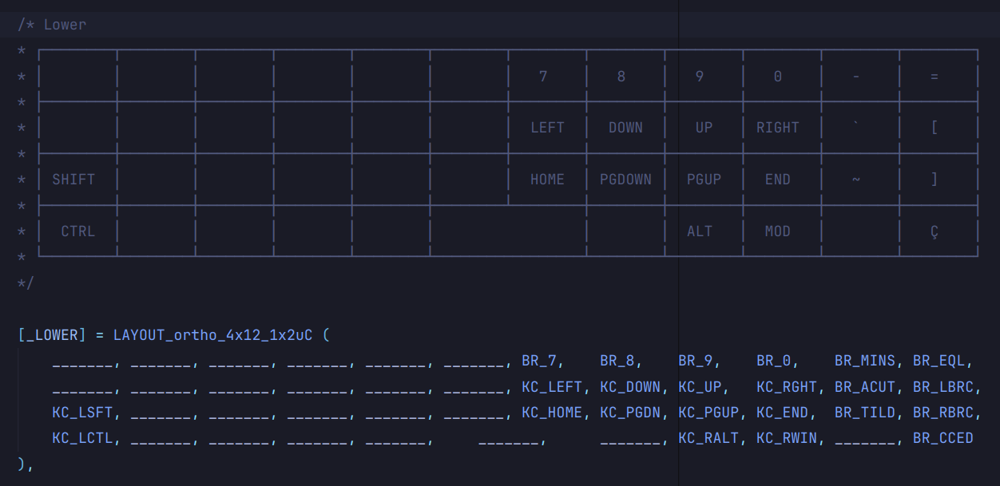
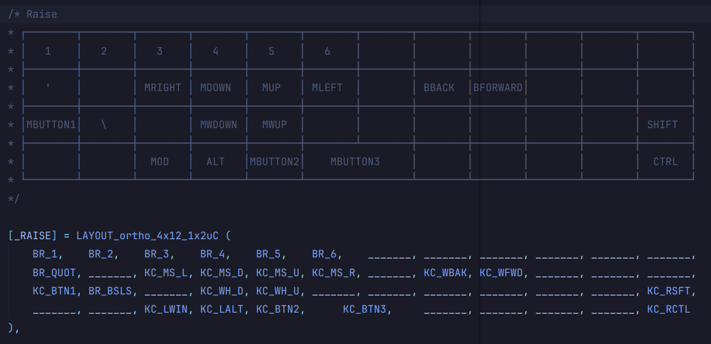
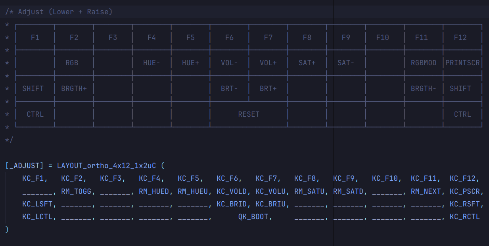

<h1 align="center">
     
    BM40 ALL BLACK - ABNT2
     
</h1>

<h4 align="center">
    My BM40 ABNT2 keyboard firmware version.
</h4>

  

<h3>Description</h3>

This is my all black build of the 40% (47 keys) ortholinear hostswap keyboard with RGB.

<b>Specs:</b>
- <b>Keycaps</b>: OEM PBT Black
- <b>Switchs</b>: JWK T1 67g
- <b>Stabilizer</b>: Black Durock v2 2U
- <b>Plate</b>: BM40 Carbon Fiber
- <b>PCB</b>: BM40 RGB from KP Republic
- <b>Case</b>: PSD40 Poseidon Black
- <b>Palmrest</b>: MDF Black (handmade)
- <b>Cable</b>: Coiled USB-C Black

<h3>Firmware</h3>

This firmware consists of a 4-layer layout with ABNT2 keys, and supports RGB and mouse control.

You can acces the original firmware [here](https://github.com/qmk/qmk_firmware/tree/master/keyboards/kprepublic/bm40hsrgb/rev2).
If you wish to modify the key layout, feel free to edit the `keymaps/default/keymap.c` file.

Keycodes references:
- [Basic Keycodes](https://docs.qmk.fm/keycodes_basic)
- [ABNT2 Keycodes](https://github.com/samhocevar-forks/qmk-firmware/blob/master/quantum/keymap_extras/keymap_br_abnt2.h)

<h3>How to use</h3>

1. Clone the QMK firmware: `https://github.com/qmk/qmk_firmware.git`.
2. Clone this repository into the folder: `qmk_firmware\keyboards\kprepublic\bm40hsrgb`.
3. Compile the firmware: `qmk compile -kb kprepublic/bm40hsrgb/bm40-abnt2 -km default`.
3. Put the keyboard in Bootloader mode.
4. Flash the firmware...

<h3>Layouts</h3>
Layer 0

  

Layer 1

  

Layer 2

  

Layer 3

  

